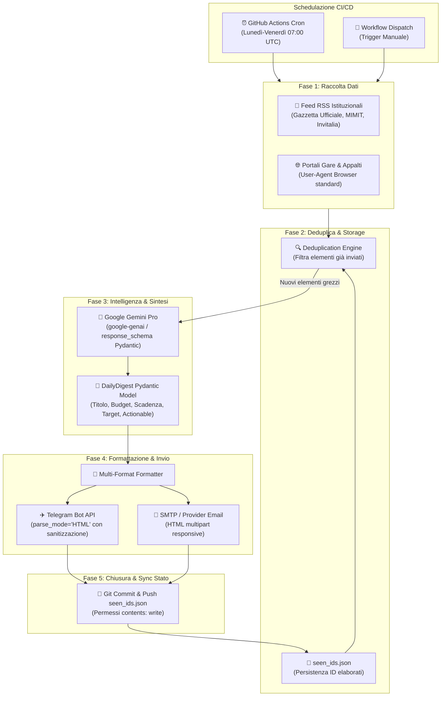

# 🏛 Architettura del Sistema: b2b-digest-agent

`b2b-digest-agent` è un micro-servizio Python serverless e stateless, progettato per raccogliere, analizzare e distribuire quotidianamente un digest di intelligence B2B (bandi pubblici di gara, appalti, opportunità PNRR e novità normative). L'esecuzione è interamente automatizzata tramite **GitHub Actions** con persistenza di stato su repository Git.

---

## 1. Diagramma di Flusso End-to-End

---

## 2. Componenti Core

### 2.1 Scraping & Prevenzione Blocchi (`scraper/base.py`, `scraper/sources.py`)
- **User-Agent Standard**: Per evitare risposte `HTTP 403 Forbidden` da portali governativi o firewall Cloudflare/WAF, `BaseScraper` imposta negli header HTTP un User-Agent tipico di un browser desktop recente (Chrome su Windows), unitamente a header `Accept`, `Accept-Language` e `Sec-Fetch-*`.
- **Pulizia del Markup**: BeautifulSoup rimuove selettivamente elementi di disturbo (`<script>`, `<style>`, `<nav>`, `<footer>`, `<aside>`, form) ed estrae il testo rilevante prima dell'invio all'LLM per risparmiare token e massimizzare il segnale informativo.
- **ID Deterministico**: Ogni elemento riceve un hash univoco SHA-256 (`hashlib.sha256(url + title)`) lungo 16 caratteri.

### 2.2 Deduplicazione e Memoria tra Esecuzioni (`storage.py`, `seen_ids.json`)
- Il file `seen_ids.json` traccia tutti gli ID inviati nelle esecuzioni precedenti.
- All'avvio, il microservizio filtra gli elementi estratti: se un elemento è già presente in `seen_ids.json`, viene escluso.
- Al termine della notifica con successo, gli ID dei nuovi elementi vengono aggiunti a `seen_ids.json`.
- In GitHub Actions, uno step finale con permessi `contents: write` esegue il commit e push del file `seen_ids.json` aggiornato sul repository, garantendo assenza di duplicati tra giorni consecutivi senza dipendere da database esterni.

### 2.3 Analisi Strutturata con Google Gemini Pro (`analyzer/gemini.py`, `models.py`)
- **SDK**: Utilizza `google-genai` (il nuovo client ufficiale unificato Google GenAI v1.0+).
- **Structured Outputs Nativo**: Gemini riceve come parametro `response_schema=DailyDigest`. La risposta dell'API è garantita al 100% conforme allo schema Pydantic, priva di parsing markdown instabile o allucinazioni di sintassi JSON.
- **Parametri Estratti**:
  - `title`: Titolo sintetico chiaro per manager aziendali.
  - `category`: Enum (`BANDO_GARA`, `NOVITA_NORMATIVA`, `AGEVOLAZIONE_FISCALE`, `OPPORTUNITA_MERCATO`).
  - `priority`: Enum (`ALTA`, `MEDIA`, `BASSA`).
  - `issuer`: Ente erogatore o stazione appaltante.
  - `estimated_budget`: Dotazione o base d'asta.
  - `deadline`: Termine perentorio per offerte/domande.
  - `key_takeaways`: Esattamente 2 o 3 punti operativi salienti.
  - `target_audience`: Settori e tipologie aziendali target.
  - `actionable_step`: Prossima mossa concreta consigliata.

### 2.4 Notifiche Multi-Canale (`notifications/`)
- **Telegram (`notifications/telegram.py`)**:
  - Utilizza rigorosamente `parse_mode="HTML"` invece di Markdown. Questo elimina i tipici problemi di crash di Telegram dovuti ai caratteri speciali non escapati in `MarkdownV2` (come `.`, `-`, `!`, `(`, `)`).
  - Tutti i campi dinamici vengono sanificati con `html.escape()`.
  - Gestisce il limite di 4096 caratteri di Telegram tramite partizionamento intelligente dei chunk di testo (`_split_html_message`).
- **Email (`notifications/email.py`)**:
  - Notifica multipart compatibile con qualsiasi provider SMTP (SendGrid, Mailgun, Brevo, AWS SES o Gmail).
  - Include versione testo Markdown puro per client testuali e una grafica HTML responsive con badge colorati per priorità.

---

## 3. Gestione Sicurezza e Segreti (GitHub Actions)

Tutte le credenziali sono isolate e passate tramite GitHub Secrets nel repository:
- `GEMINI_API_KEY`: Chiave API Google AI Studio.
- `TELEGRAM_BOT_TOKEN`: Token del bot creato con @BotFather.
- `TELEGRAM_CHAT_ID`: ID del canale, gruppo o utente Telegram destinatario.
- `SMTP_HOST`, `SMTP_PORT`, `SMTP_USER`, `SMTP_PASSWORD`, `SMTP_TO_EMAIL`: Credenziali del server di posta (opzionale).

Nessun dato sensibile o chiave API è salvato all'interno del codice o nel repository Git.
